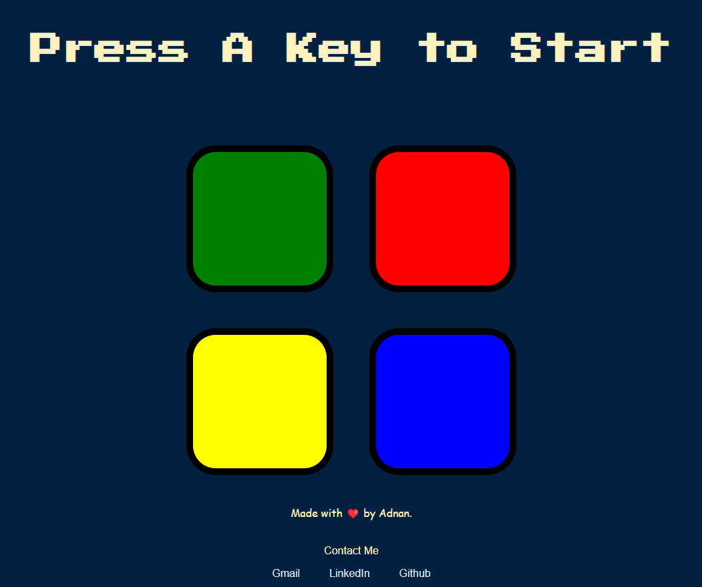

# Simon-Game
Get ready to watch, remember, repeat!  Experience the fun as you repeat the patterns and advance to higher levels. 
  

### Features

* In this project the buttons flash and the user is to copy the sequence and click the correct button.
* I have a counter so the user knows what level they are on throughout the game.
* I have used a random function which will allow the game to use a unique sequence each time.

### Technologies Used

JQuery - I have used jQuery to simplify DOM manipulation  
Font Awesome - I have used font awesome to add some different font onto my website.  
CSS - For styling the game  
HTML - For the elements of the game  
